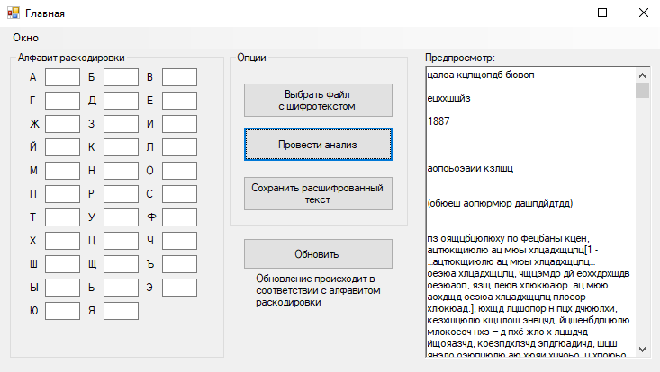
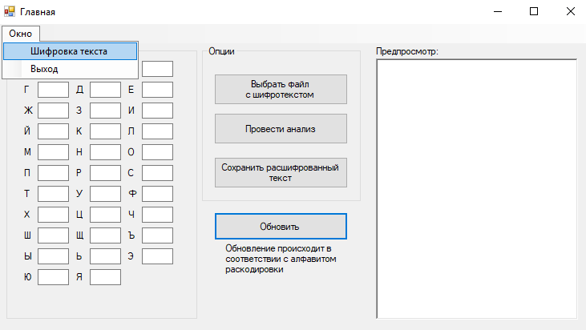
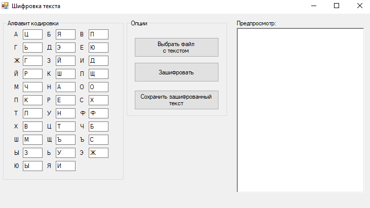

# FrequencyAnalyzer
Давайте представим, что два шпиона решили шифровать свою переписку следующим методом шифрования:
каждому символу исходного текста ставится в соответствие произвольный символ, а далее происходит полная замена символов
исходного текста на символы замены.
Например, пусть таблица замены будет выглядеть следующим образом:
А - П
Б - Ц
В - Й
Е - Ъ
Н - С
Тогда фраза БАБА В БАНЕ будет выглядеть, как ЦПЦП Й ЦПСЪ 

С помощью данной программы пользователь сможет путем частотного криптоанализа расшифровать такую переписку.

Главное окно программы выглядит следующим образом:

Интерфейс данной программы интуитивно понятен, соответственно, не имеет смысла расписывать назначение каждой функции.
Однако, после того, как пользователь выбрал файл с шифротекстом, ему необходимо провести анализ данного текста для предварительного составления таблицы замены символов. После проведения анализа необходимо вручную корректировать таблицу замены для расшифровки текста.

Данная программа позволяет произвести саму замену символов исходного текста (зашифровать текст). Для этого в главном окне программы нужно выбрать соответствующий пункт меню.

Откроется новое окно программы для шифрования файла. Внешне похоже на главное окно.
Слева уже есть составленная таблица замены символов. Естественно, ее можно изменить и зашифровать файл своей таблицей.

